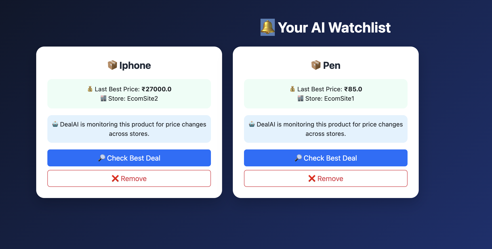

# AI E-Commerce Offer Recommendation System

## Overview
This project is an AI-powered system that compares product offers from multiple e-commerce websites and recommends the best deal.

The system fetches offers from different stores, ranks them using a machine learning model, and explains the recommendation using an AI model.

---

## Features
- Multi-store product search
- AI-based deal ranking
- Real-time price monitoring agent
- Email alerts for price drops
- Watchlist for tracking products
- AI explanation for recommended deals
- User authentication (login/register)

---

## Technologies Used
- Python
- Flask
- SQLite
- Scikit-learn
- Ollama (LLM)
- HTML / CSS / Bootstrap
- JavaScript

---

## Project Structure

AI_Ecommerce_Offer_Recommendation_System
│
├── main_app
│ ├── app.py
│ ├── fetcher.py
│ ├── scorer.py
│ ├── price_agent.py
│ └── templates
│
├── ecommerce_sites
│ ├── ecommerce_site_1
│ └── ecommerce_site_2
│
├── database
│ ├── deal_model.pkl
│ └── training_data.csv
│
└── requirements.txt

---

# Project Screenshots
## System Architecture

## All Products with Ranking

## Best Recommended Deal

## Watchlist

## Price Drop Email Alert

## After Price Drop

---

## Installation

Clone the repository

git clone https://github.com/Yashwanth205/AI-Ecommerce-Offer-Recommendation-System.git

Install dependencies

pip install -r requirements.txt

Run the application

python app.py

---

## Author
Yashwanth
=======
# AI E-Commerce Offer Recommendation System

## Overview
This project is an AI-powered system that compares product offers from multiple e-commerce websites and recommends the best deal to users.

The system collects product data from different stores using APIs, ranks offers using a machine learning model, and provides explanations using a Large Language Model.

## Features
- Multi-store product search
- AI-based offer ranking
- Real-time price monitoring
- Email alerts for price changes
- User authentication (Login / Register)
- Watchlist for tracking products
- LLM-generated explanation for recommended deals

## Technologies Used
- Python
- Flask
- SQLite
- Scikit-learn
- NLTK
- Ollama (LLM)
- HTML / CSS / Bootstrap
- JavaScript

## System Architecture
User → Flask Web App → API Fetcher → ML Ranking Model → LLM Explanation → UI

## Project Structure

AI_Offer_Recommendation_System
│
├── main_app
│ ├── app.py
│ ├── fetcher.py
│ ├── scorer.py
│ ├── price_agent.py
│ └── templates
│
├── ecommerce_sites
│ ├── ecommerce_site_1
│ └── ecommerce_site_2
│
├── database
│ ├── users.db
│ ├── watchlist.json
│ └── alerts.json
│
└── requirements.txt

## Installation

Clone the repository

git clone https://github.com/Yashwanth205/AI-Ecommerce-Offer-Recommendation-System.git

Install dependencies

pip install -r requirements.txt

Run ecommerce sites

python run.py

Run main system

python app.py

## Future Improvements
- Integrate real e-commerce APIs
- Improve ML ranking model
- Add recommendation personalization
- Deploy system on cloud

## Project Screenshots
## System Architecture

### Home Page

### AI Recommended Deal

### Watchlist Page

### Email Alert

### Login Page

## Author
Yashwanth
